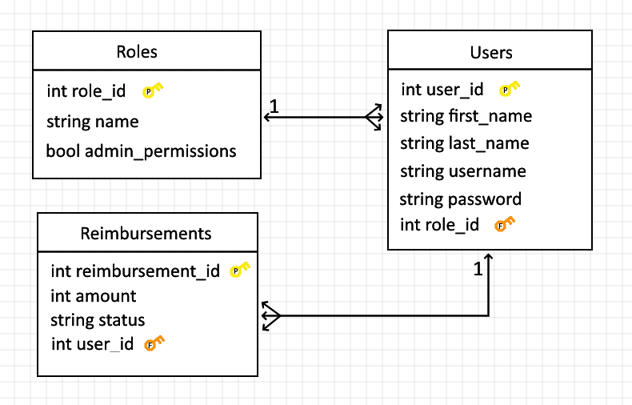

# Project 1 - ERS

This is a **Java Full Stack Employee Reimbursement System (ERS)**. The  ERS centers around Employees submitting Reimbursements that can either be accepted or denied by Managers. It is made using:
- React-Based Front End (talks to backend via HTTP)
- Spring-Based Back End
- Local Postgresql database

Notable tech includes:
- TanStack Router
- TanStack Query
- Shadcn Components
- JWT Tokens

**Employees using the application can:**

- Create a new Reimbursement

- See all reimbursement tickets (only their own)

- See only their pending reimbursement tickets

- Update an existing reimbursement's description or amount.

**Managers using the application can:**

- See all reimbursements

- See all reimbursements of a given status

- Resolve a reimbursement (update status from PENDING to APPROVED or DENIED)

- See all Users

- Delete a User and any related reimbursements

- Update existing user information, including role

**Users who are not logged in to the application can ONLY:**

- Attempt to log in

- Register for a new account (create new User)

**ERD:**

**Challenges:**

- Unideal starting architectural issues - there's such thing as too little coupling

- Tables take a lot of work to manipulate, didn't get them how I wanted to

**Future Enhancements:**

- More data!
  - Reimbursement last modified timestamp
  - Reimbursement approved timestamp
  - Reimbursement approver
- Registration from users page